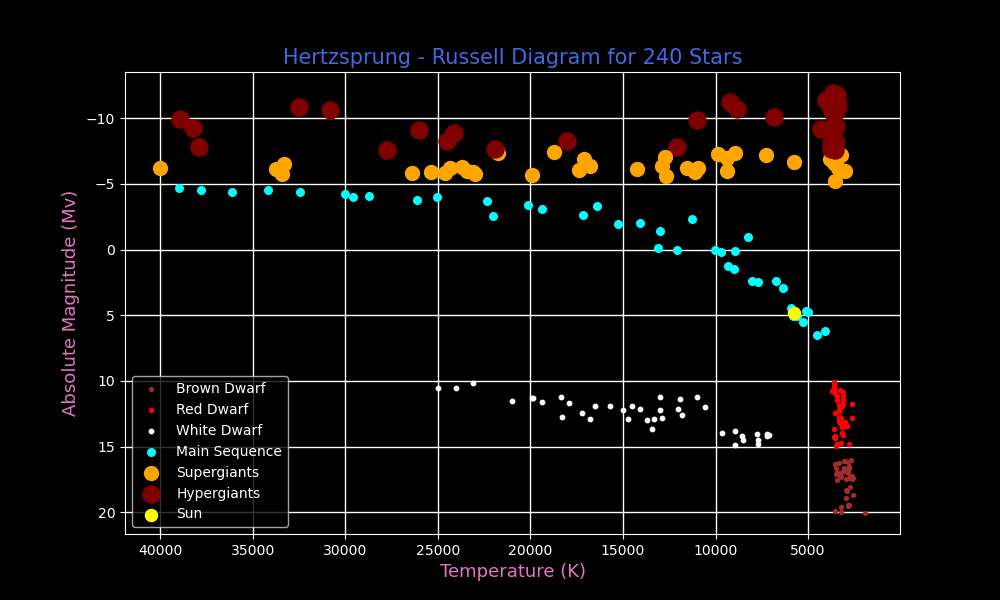

   
      
   

<h3 align="center">Astronomical data and Images visualization</h3>

   

     The main purpose of the repo is to visualize HR Diagram of the stars, and to classify them        
      
     0 → Brown Dwarf       
1 → Red Dwarf        
2 → White Dwarf       
3 → Main Sequence          
4 → Supergiants        
5 → Hypergiants      
    

## <a name="tech-stack">⚙️ Tech Stack</a>

- pandas
- matplotlib
- seaborn
- astroquery
- astropy
- jupyter-notebook

 
 
    

